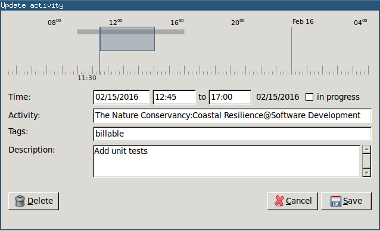

## Hamster GetMyTime

Convert timesheet entries created by [Hamster Indicator](https://apps.ubuntu.com/cat/applications/precise/hamster-indicator) to JSON.
The output can be consumed by [getmytime-cli](https://github.com/kdeloach/getmytime-cli) to submit timesheet
entries directly into [GetMyTime](http://www.getmytime.com).

New activities in Hamster must be created in the following format:

`<client name>@<activity>, <description> <tags>`

### Examples

CLI:

`ACME@Software Development, fixing some bugs... #billable`

GUI:



### Usage

```
./hamster.py -h
usage: hamster.py [-h] [start_time] [end_time]

positional arguments:
  start_time
  end_time

optional arguments:
  -h, --help  show this help message and exit
```
